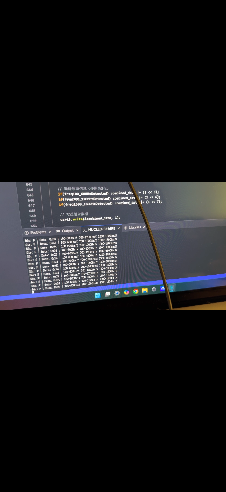

# final-project-skeleton

    * Team Name: 21
    * Team Members: V50
    * Github Repository URL: Gengzhi Zhu & Yuetian Zhao & Jinrong Liu
    * Github Pages Website URL: [for final submission]: https://github.com/Jinrong-Liu-10/team21.github.io 
    https://yuetianzhao.github.io/team21.github.io/
    * Description of hardware: (embedded hardware, laptop, etc) :
     STM32 Microcontroller
     ATMEGA328PB Microcontroller
     MAX4466 Microphone Sensor
     1.8" Color TFT LCD with SPI Interface
     3 LEDs
     RC Servo motor

## 1. Video Presentation

  

## 2. Project Summary and images

<table><tr>
   <td></td>
   <td></td>
   <td></td>
</tr><tr>
</tr></table>

<table><tr>
   <td></td>
   <td></td>
</tr><tr>
</tr></table>

### Device Description
Our device aims to create a sound detect system, allowing users to speak and the RC SERVO motor will rotate to follow the source of the sound. Users can use LCD to check the different component of the frequency. Moreover, LEDs can also be a way to show the source of the sound(left, front, right).

### Inspiration
The inspiration for our sound detection system comes from the challenges faced by cameramen in dynamic environments, where quickly identifying and tracking the source of a sound is crucial. Imagine a live event or a documentary shoot—cameramen often need to react swiftly to unexpected sound cues, such as a speaker's voice, a sudden noise, or other auditory signals. By enabling the camera to automatically identify and follow the source of the sound, our system aims to revolutionize filming dynamics, enhancing efficiency and ensuring that key moments are captured seamlessly. This innovation bridges the gap between auditory and visual tracking, empowering creators to focus on storytelling rather than manual adjustments.

### Device Functionality
Our sound detection and tracking system is designed to seamlessly integrate auditory and visual intelligence, offering the following key functionalities:
1. Sound Source Tracking: The system identifies the direction of the sound source in real time, distinguishing whether it is coming from the left, right, or directly in front of the device.
2. Directional Sound Information Display: It visually displays the detected sound's directional information, categorizing it into left, right, or front regions for intuitive understanding.
3. Frequency Component Analysis: The system analyzes the frequency components of the detected sound, providing detailed insights into the audio characteristics of each directional segment.
4. Motorized Camera Rotation: The system is equipped with motorized rotation capabilities, enabling the camera to automatically orient itself toward the source of the sound, ensuring accurate tracking and capturing of the scene.

## 3. Hardware Requirements

#### HRS 01 - STM32 Microcontroller
Our project is based on evaluation board. The MCU STM32 microcontroller, with ST-link used to flash the code into the Board.

#### HRS 02 - MAX4466 Microphone Sensor
In compliance with HRS 02, our system employs the MAX4466 module microphone sensor, which detects a wide range of sound and amplify it, when no sound, the system should show 2048 value for our 12-bit ADC. The typical accuracy is ±5 % for offset situation and with high volume, the ADC value should reaches 3000, for low volume, ADC should reaches 2500.

#### HRS 03 - 1.8" Color TFT LCD with SPI Interface
The implementation of the 1.8" Color TFT LCD with an SPI interface in our project was crucial for displaying detailed sound information. This LCD module communicates with the microcontroller through the SPI, ensuring swift and stable data updates.

#### HRS 04 - RC Servo motors
The RC servo motors should rotate according to the postion of the sound, and it can rotate from 0 to 270 Degrees, it should follow the sound with accuracy that it should point to the sound that less than 20 degree.

#### HRS 05 - System Integration and Control
Our development team has implemented a system that use three evaluation board(2 ATMEGA328PB and 1 STM32), we use USB as power supply which enable the system work correctly.

## 4. Software Requirements

#### SRS 01 - ADCs and DMA for FFT
The ADCs should set in continuous mode, and let the A/D transition less than 50us per data and then transmit to array by DMA, by doing this, it can have enough 256 bytes data for FFT and also to improve accuracy. 
image4

#### SRS 02 - Display Management
We manage a 1.8" Color TFT LCD screen with an SPI interface, capable of displaying sound details. Current performance shows 3 different range of frequency component of the sound and show the position of the sound, the data to SPI is 9600 BPS.
image5

#### SRS 03 - UART and GPIO data transmition
Our system need to transmit data from STM32 to ATMEGA328PB, we use two communication approach, UART with 9600 baud rate and GPIO that will set high for 60ms when detect the postion sound information(left, front, right).
The following figure shows the test to detect if the stm32 successfully transfers the signal to the atmega via uart3. We have added the function in the code to let the serial monitor display the content of the transfer, and the output of the stm32 TX will be displayed to the serial monitor to verify the communication between the two MCUs.

image6

## 5. Conclusion
Reflecting on the development process of our sound detection and tracking system, several aspects could have been approached differently to enhance efficiency and performance:

1.Microphone Selection and Calibration Process: To address the challenge of inaccurate microphones, we could have prioritized the selection of high-quality directional microphones or microphone arrays from the outset. Additionally, incorporating an automated or algorithm-driven calibration process would have significantly reduced the time and effort required for manual adjustments, improving the system’s adaptability to different environments.

2.Conflict Resolution between UART and Timer1: The conflict between UART and Timer1 could have been mitigated earlier in the design phase by adopting advanced resource-sharing techniques or exploring alternative communication protocols like SPI. This would have minimized integration issues and streamlined the motor rotation control. Leveraging simulation tools to identify and address hardware conflicts during the initial development stages might have saved debugging time later on.  

  
## 6.Challenges
In general, we faced four challenges and partly solved them in the right way.

#### 1. Microphone Calibration for Accuracy
One of the key challenges is the microphone's initial inaccuracy in detecting and localizing sound sources. Precise sound direction detection requires meticulous calibration to ensure the system's reliability. This calibration process can be time-consuming, especially in environments with varying acoustics or interference, requiring careful adjustments to align the microphone array for optimal performance.
#### 2. UART and Timer1 Conflict for Motor Rotation
Another significant challenge is managing the conflict between the UART communication protocol and Timer1, which controls the motor rotation. Both functionalities are critical, but their simultaneous operation can lead to timing issues and resource contention. Resolving this conflict requires efficient scheduling or alternative methods, such as interrupt-driven mechanisms or prioritization strategies, to ensure seamless motor control without disrupting data communication.
####3.Establishing stable communication between three microcontrollers powered by different USB ports. 
In our project, it was equally challenging to establish stable communication between three microcontrollers powered by different USB ports, where the STM32 communicates with the ATmega1 via UART and the ATmega1 communicates with the ATmega2 via GPIO.   

The instability during system startup is the main problem we encountered. Since each MCU is powered by a different USB port, there are slight differences in the ground potentials of the different USB ports, which may form ground loops when we connect a common ground, and these loops will introduce interference in the communication signals, resulting in unpredictable logic levels caused by voltage differences between different USB grounds. Also, asynchronous startup timing of the three boards and differences in power supply stabilisation times can cause UART communication to start before the system is fully stabilised, resulting in data errors  
.
To address these challenges, we created a single common grounding point, added a startup delay sequence to the code, added an error detection mechanism for the communication protocols, and implemented a system reset sequence that ensures that the three MCUs initialise correctly.  

Despite these measures, the system still required a specific power-up sequence to establish stable communication: we needed to power up the STM32 first and wait for it to stabilise, then power up the two ATmega's in turn and ensure that all ground connections were reliable.

## MVP Demo

1.github URL 

upenn-embedded/final-project-v50: ese5190f24-final-project-final-project-skeleton created by GitHub Classroom 

2&3.
We use two separate ADCs to simultaneously acquire data, and then utilize DMA to store the data in arrays for further processing. 

void ADC1_DMA_Init(void) { 
    // Enable clocks for ADC1 and DMA2 

    RCC->APB2ENR |= RCC_APB2ENR_ADC1EN; // Enable ADC1 clock 

    RCC->AHB1ENR |= RCC_AHB1ENR_DMA2EN; // Enable DMA2 clock 

 

    // Configure GPIOA pin PA0 (ADC1_IN0) as analog mode 

    RCC->AHB1ENR |= RCC_AHB1ENR_GPIOAEN; // Enable GPIOA clock 

    GPIOA->MODER |= (3 << (0 * 2));      // Set PA0 to analog mode 

 

    // Configure ADC1 

    ADC1->CR1 = 0;                       // 12-bit resolution, single channel 

    ADC1->CR2 = ADC_CR2_CONT |           // Continuous conversion mode 

                ADC_CR2_DMA |            // Enable DMA 

                ADC_CR2_DDS;             // DMA in circular mode 

    ADC1->SQR3 = 0;                      // Channel 0 (ADC1_IN0) 

    ADC1->SMPR2 = (7 << 0);              // Set sample time for channel 0 (480 cycles) 

 

    // Configure DMA2 Stream 0 (connected to ADC1) 

    DMA2_Stream0->CR = 0;                // Reset control register 

    while (DMA2_Stream0->CR & DMA_SxCR_EN); // Ensure DMA stream is disabled 

 

    DMA2_Stream0->PAR = (uint32_t)&ADC1->DR;     // Peripheral address (ADC1 data register) 

    DMA2_Stream0->M0AR = (uint32_t)adc1_val; // Memory address (buffer) 

    DMA2_Stream0->NDTR = ADC_BUFFER_SIZE;       // Number of data to transfer 

    DMA2_Stream0->CR = DMA_SxCR_PL_1 |          // High priority 

                       DMA_SxCR_MSIZE_0 |       // Memory size: 16-bit 

                       DMA_SxCR_PSIZE_0 |       // Peripheral size: 16-bit 

                       DMA_SxCR_MINC |          // Memory increment mode 

                       DMA_SxCR_CIRC |          // Circular mode 

                       DMA_SxCR_DIR_0;          // Peripheral-to-memory direction 

 

    // Enable DMA2 Stream 0 

    DMA2_Stream0->CR |= DMA_SxCR_EN; 

 

    // Enable ADC1 

    ADC1->CR2 |= ADC_CR2_ADON; 

 

    // Start ADC1 conversion 

    ADC1->CR2 |= ADC_CR2_SWSTART; 

} 

 

We configure one of the ADC channels as an analog input and use DMA to transfer the data to the adc1_val buffer. The same procedure is applied to the second ADC. 

Once we collect 256 data points in both the adc1_val and adc2_val buffers, we compare the values. Using the position relationship, we employ a counter to determine which buffer has the higher value. If the adc1_val contains the larger value, we set PA5 high for 80ms, then set it low. If the adc2_val contains the larger value, we set PA6 high for 80ms, then set it low. These signals are connected directly to the ATMEGA328PB, which uses them to determine the motor's rotation direction. 

int adc1_greater_count = 0; 

 

        for (int i = 0; i < ADC_BUFFER_SIZE; i++) { 

            if (ADC1_Buffer[i] > ADC2_Buffer[i]) { 

                adc1_greater_count++; 

            } 

        } 

 

        if (adc1_greater_count > (ADC_BUFFER_SIZE / 2)) { 

            GPIOA->ODR |= GPIO_ODR_OD5;  

            HAL_Delay(80); 

            GPIOA->ODR &= ~GPIO_ODR_OD5; 

        } else { 

            GPIOA->ODR |= GPIO_ODR_OD6;  

            HAL_Delay(80); 

            GPIOA->ODR &= ~GPIO_ODR_OD5; 

        } 

 

In addition, we use ARM math libraries to perform a Fast Fourier Transform (FFT) on the adc1_val buffer to analyze the frequency content. The resulting data is sent via UART to the ATMEGA328PB, which interfaces with an LCD module to display the frequency information. 

        init_data(); 

      arm_cfft_f32(&arm_cfft_sR_f32_len256 , fft_data, 0 ,1); 

      arm_cmplx_mag_f32(fft_data, data_out, DATA_LENGTH / 2); 

      avg[0] = 0; 

      for(int i = 0; i < 25; i++) { 

          avg[0] += data_out[i]; 

      } 

      avg[0] /= 128; //100Hz 

 

      avg[1] = 0; 

      for(int i = 25; i < 50; i++) { 

          avg[1] += data_out[i]; 

      } 

      avg[1] /= 128; //200Hz 

 

      avg[2] = 0; 

      for(int i = 50; i < 75; i++) { 

          avg[2] += data_out[i]; 

      } 

      avg[2] /= 128; //300Hz 

 

      avg[3] = 0; 

      for(int i = 75; i < 100; i++) { 

          avg[3] += data_out[i]; 

      } 

 

 

      avg[4] = 0; 

      for(int i = 100; i < 125; i++) { 

          avg[4] += data_out[i]; 

      } 

      avg[4] /= 128; //500Hz 

 

      for(int i = 0; i < 5; i++){ 

          char* buffer; 

          float_to_string(avg[i], buffer, 1); 

          UART_SendString(buffer); 

      } 

 

We use two seperate ports as input signal to receive signal to determine whether motor rotate left or right. 

void gpio_init() { 

    DDRD &= ~(1 << LEFT_PIN); 

    DDRD &= ~(1 << RIGHT_PIN); 

    DDRB |= (1 << LED); 

} 

 

 

For motors, we use 280Hz frequency to control our motor, and vary its duty cycle by changing OCR0B. 

void timer1_init() {  

    // Set PB2 as output 

    DDRB |= (1 << MOTOR_PIN); 

    OCR1A = 900; // FREQUENCY 

    OCR1B = 450; // DUTY CYCLE = (OCR0A - OCR0B) / OCR0A 

     

    // Set Timer to FAST PWM mode with TOP = OCR0A (WGM02:0 = 001) 

    TCCR1A |= (1 << WGM10);  

    TCCR1A |= (1 << WGM11);   

    TCCR1B |= (1 << WGM12);  

    TCCR1B |= (1 << WGM13); 

     

    TCCR1A |= (1 << COM1A0); 

    TCCR1A |= (1 << COM1A1); 

     

    TCCR1A |= (1 << COM1B0); 

    TCCR1A |= (1 << COM1B1); 

 

    // Set prescaler to 256 

    TCCR1B &= ~(1 << CS12); 

    TCCR1B |= (1 << CS11); 

    TCCR1B |= (1 << CS10); 

 

} 

 

void rotate(uint8_t flag){ 

    if(flag == 1){ 

        if(OCR1B > 100){ 

            OCR1B--; 

        } 

    } 

    else{ 

        if(OCR1B <= 800){ 

            OCR1B++; 

        } 

    } 

} 

 

If signal PD4 received we let it rotate left, otherwise, rotate left. 

        if(PIND & (1 << PIND4)) { 

            rotate(0); 

            //PORTB |= (1 << LED); 

        } 

        else if(PIND & (1 <<PIND3)) { 

            //PORTB ^= (1 << LED);  

            rotate(1); 

            //PORTB &= ~(1 << LED); 

        } 

 

4. Currently we have make the microphone rotate accurate enough to follow the sound in 30cm 

5. We let the motor rotate as we expected to follow the sound. 

6. We still need to finish UART communication through ATMEGA328PB and STM32 and LCD module, also the 3D printing 

7. https://drive.google.com/file/d/1KB4CcpbpYN1mqRFmcyycBe9k0Av-pOrb/view?usp=sharing 

8. The riskiest part of the project is the microphone is not accurate enough, so need to manually calibrate it. 

## Sprint review #1

### Current state of project
2.
Since our components are not arrived, our main address for the week is set up the environment to do the work and to finish ADC module and open TIMER in stm32f4 to control the motor.

4.
For the software part, due to the accuracy of the microphone, we can not too far away from the microphone.
5.
For the hardware part, UART and LCD still not finished.
6.
For the remaining of the process, we will finish LCD and UART part, also finish 3d printing.

8. the riskiest part of the project is component selection, we find the microphone data is not accurate that we expected, which means we can not too far away from the microphone 

### Last week's progress 
Finished components ordering, and have the ideal of the project.
### Next week's plan
Get the motor rotate with the sound.
   
## Sprint review #2

### Current state of project
We have finished the microphone and some fft algorithm, our next step is assemble our parts, since the microphone is not accurate enough, we are thinking using software to calibrate it.
### Last week's progress
Finished the sensor parts, and fft part, also we use 3D printing
### Next week's plan
assemble our part, finished UART to allow STM32 and ATMEGA communication, and LCD part(hopefully we can use LCD to demo every 100Hz of our voice signal.

## Final Project Proposal

### 1. Abstract

This project aims to create a system that captures sound, then use motor platform to follow the source of the sound. The audio input will be processed by DSP to analyze its frequency components, which enable LEDs to respond to different frequencies. Additionally, the processed sound data will be sent to a server via Wi-Fi for further analysis and storage. 

### 2. Motivation

This project tackles two main challenges: digital signal processing (DSP) for noise filtering and motor control using PID (Proportional-Integral-Derivative) and PWM (Pulse Width Modulation) techniques. The objective is to develop a system that captures sound, particularly from objects emitting specific frequencies, and accurately tracks their source. By analyzing the frequency components of the sound, the system can isolate and follow a target, such as a drone. This capability has practical applications in real-life scenarios, such as helping individuals evade drones by detecting their direction. The integration of frequency analysis, noise filtering, and precise motor control makes this project both innovative and relevant.

### 3. Goals

This project aims to create a system that effectively tracks sound sources using multiple technologies. Our goals include:

1. Integrating three microphones to capture analog sound, converting it to discrete digital information using an ADC.
2. Comparing the amplitude of the captured sound to control a motor that tracks the sound source.
3. Implementing PID (Proportional-Integral-Derivative) control for precise motor movement.
4. Applying digital signal processing (DSP) algorithms to filter noise and separate different frequency components.
5. Utilizing DSP data to drive LED PWM lighting that visually responds to sound.
6. Sending processed data to a Wi-Fi module for further analysis and storage.
7. Ensuring a reliable power supply for the entire system.

### 4. System Block Diagram

### 5. Design Sketches

### 6. Software Requirements Specification (SRS)
### 6.1 Overview
This project creates a system that converts analog sound into digital data using the STM32F4 microcontroller. The data is transmitted to a server via Wi-Fi every few seconds. It uses digital signal processing (DSP) to filter noise and controls a motor with feedback from an MPU for PID control, allowing precise tracking of sound sources in real time.
### 6.2 Definitions, Abbreviations
Keil for develop the system.
MATLAB for frequnecy analysis and filter design. 
sound_data_before_filter 16 bits data after ADC
dsp_data data(bits to be determined) processed after DSP
pos_x MPU data(16 bits) send to MCU
pos_y MPU data(16 bits) send to MCU
### 6.3 Functionality
  1.SRS 01  The IMU 3-axis acceleration will be measured with 16-bit depth every 100 milliseconds +/-10 milliseconds
  2.SRS 02  The ADC value will be measured with 16-bit depth every 0.1 milliseconds
  3.SRS 01  The DSP data will be measured with n-bit depth(to be confirmed) every 100 milliseconds

### 7. Hardware Requirements Specification (HRS)
### 7.1 Overview
There will be 7 parts, microphone, motor, MCU, MPU, power supply, WIFI module, LED.  
HRS 01 - STM32 Microcontroller
Our project is based on evaluation board. The MCU STM32 microcontroller, with ST-link used to flash the code into the Board.

HRS 02 - MAX4466 Microphone Sensor
In compliance with HRS 02, our system employs the MAX4466 module microphone sensor, which detects a wide range of sound and amplify it, when no sound, the system should show 2048 value for our 12-bit ADC. The typical accuracy is ±5 % for offset situation and with high volume, the ADC value should reaches 3000, for low volume, ADC should reaches 2500.

HRS 03 - 1.8" Color TFT LCD with SPI Interface
The implementation of the 1.8" Color TFT LCD with an SPI interface in our project was crucial for displaying detailed sound information. This LCD module communicates with the microcontroller through the SPI, ensuring swift and stable data updates.

HRS 04 - RC Servo motors
The RC servo motors should rotate according to the postion of the sound, and it can rotate from 0 to 270 Degrees, it should follow the sound with accuracy that it should point to the sound that less than 20 degree.

HRS 05 - System Integration and Control
Our development team has implemented a system that use three evaluation board(2 ATMEGA328PB and 1 STM32), we use USB as power supply which enable the system work correctly.

### 7.2 Functionality
The motors should rotate between 0 to 270 degrees and also when the sound is from center of the microphone, it should stay at the position, when left microphone detect the sound, it should rotate left, when right microphone detect the sound, it should rotate right. 
The LCD should show frequency components of 100 - 1200Hz.
Projects shall be based on STM32F401RE
microphone will need have good front, end pickup pattern, the initial thought would be KY-038
IMU shall be use MPU6050
WIFI module shall be use ESP32 
motor shall support IIC or CAN communication  

### 8. Software Requirements Specification (HRS)
#### SRS 01 - ADCs and DMA for FFT
The ADCs should set in continuous mode, and let the A/D transition less than 50us per data and then transmit to array by DMA, by doing this, it can have enough 256 bytes data for FFT and also to improve accuracy.   

  

#### SRS 02 - Display Management
We manage a 1.8" Color TFT LCD screen with an SPI interface, capable of displaying sound details. Current performance shows 5 different frequency component of the sound and show the position of the sound, the data to SPI is 9600 BPS.
We manage a 1.8" Color TFT LCD screen with an SPI interface, capable of displaying sound details. Current performance shows 3 different range of frequency component of the sound and show the position of the sound, the data to SPI is 9600 BPS.  

  

#### SRS 03 - UART and GPIO data transmition
Our system need to transmit data from STM32 to ATMEGA328PB, we use two communication approach, UART with 9600 baud rate and GPIO that will set high for 60ms when detect the postion sound information(left, front, right).
The following figure shows the test to detect if the stm32 successfully transfers the signal to the atmega via uart3. We have added the function in the code to let the serial monitor display the content of the transfer, and the output of the stm32 TX will be displayed to the serial monitor to verify the communication between the two MCUs.  

  

### 9. Components

The MCU should have FPU and have a large relative RAM to complete DSP algorithms, and also have at least 2 ADC and one timer, our choice is STM32F446 and servo motor control, we use atmega328pb for motor control 
https://www.digikey.com/en/products/detail/stmicroelectronics/NUCLEO-F446RE/5347712

For microphone, we want to use module to reduce workload, our choice is KY-038, since it it modular, which reduce workload to redesign an amplifier
[https://www.amazon.com/DEVMO-Microphone-Sensitivity-Detection-Arduino/dp/B07R452F6J/ref=pd_lpo_sccl_2/147-7977676-9188223?pd_rd_w=YKrNA&content-id=amzn1.sym.4c8c52db-06f8-4e42-8e56-912796f2ea6c&pf_rd_p=4c8c52db-06f8-4e42-8e56-912796f2ea6c&pf_rd_r=00BK44ZNARHGD4G26S2C&pd_rd_wg=Z2npc&pd_rd_r=65de2fe2-2fd5-4124-b148-56c567dcddf5&pd_rd_i=B07R452F6J&th=1](https://www.amazon.com/KY-038-Sensitivity-Detection-Microphone-Module/dp/B09W157963)

For IMU, we will use MPU6050
https://www.digikey.com/en/products/detail/dfrobot/SEN0142/6588492

For Motors, we decide to use this servo motor
https://www.amazon.com/Miuzei-Waterproof-Compatible-Steering-Horn（270°）/dp/B0C5LWHTQ1/ref=sr_1_4_sspa?dib=eyJ2IjoiMSJ9.uAVrkFDoXjC5ivnbOqxanhmnWQfgWObJWhZ6x2ZaCcRzWP6Rmi_fvGBDKueZcs4yqv4MUuX8KGyA6zj8MhNSiweX9l7yT7uUVYyVMapjdSsnpJ7Pt9cJVlHWPMrgHJITVGxgH92vFTdJ9D56dI6DvlHON9QKuX-TJZ_OWkk12PXDx1NtCuKaBpUr95ZzUpHPz4bwhErdtMGJjL02d2gmFgdmv6ohiWK6MpyNG8glx5TcZh4s0jomp3VRq_GoKSZc-B_UvI8G0BskevWhi-aRKEQPIm4XGnT9E_YQEfitzX4.mSR_-otcXv9I-rw31MgP71H1RdjaBrz9xr1Vjfv_v0I&dib_tag=se&keywords=SERVO+Motor&qid=1730410329&sr=8-4-spons&sp_csd=d2lkZ2V0TmFtZT1zcF9hdGY&psc=1

### 10. Final Demo

For basic level of our system, it can detect sound and let the motor rotate to the source of the sound, if we can achieve advanced feature, we will let ESP32 to allow phone choose certain frequency and we only track that frequency of the sound.

### 11. Methodology

We will divide our task into 4 parts, first part is quite simple, that is get value from our sensors, second is let motor rotate with degree that we want, the third part also the most chanllenging part, we need to complete a DSP algorithm and let LED shining, fourth part is our motor with PID control and keep track of people. 
we will set first task and second task a short deadline, then for the third and fourth we will assign a longer deadline.

### 12. Evaluation
The outcome of this project will be a functional prototype that serves as an initial proof of concept. We will conduct thorough testing to evaluate the performance of both the DSP filtering and the PID control mechanisms. Key evaluation criteria will include:

Performance Metrics: Assessing the accuracy and stability of the motor control, along with the effectiveness of the filter in reducing noise.

### 13. Proposal Presentation

Add your slides to the Final Project Proposal slide deck in the Google Drive.

### 14. Sprint 1(first week 11.8)

   * Progress over the past week:  
     Buy all of the needed component(upload the image in first week file)     
     Write the ADC libarary(upload in ADC.file)    
   *Overall status of the project:  
     Buy all of the needed component including backup(upload the image in first week file)  
     Finish all of the prepared step  
   *Plans for next week:  
     Before 11.15 we will test the ADC function of the STM32 board, and the communication between ATmegas  
     Get the motor rate of the sound.  

### 15 Sprint 2(second week 11.15)  
 * Progress over the past week:  
      1.We tested the function of the microphone and found that the KY038 is not sensitive to the external ring sound,
      and it is not possible to adjust the amplification, and it can only present a positive value in the output,
      which does not satisfy the function of our device.
   
      2. On the code side, the ADC code for the microphone was completed,
      the control algorithm for the motor, and the microphone algorithm used bandpass filtering.

   *Overall status of the project:
      Approximately 50 percent of the project is completed
   
   *Plans for next week:
   Purchase a new microphone COMPONENT and test the new microphone to see if it can be realized to detect the volume of the environment.
   Finish porting the code on stm32.
     
## References

Fill in your references here as you work on your proposal and final submission. Describe any libraries used here.

