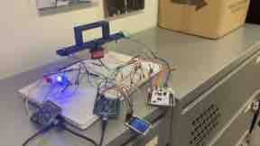
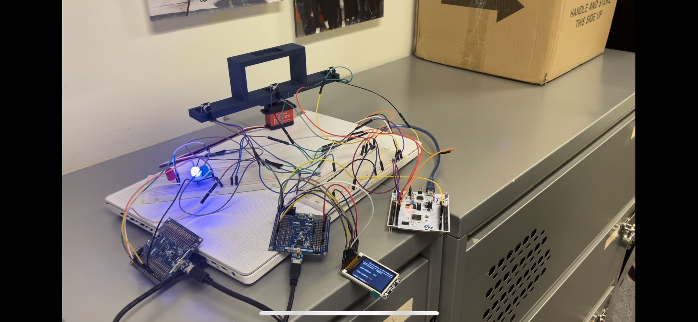
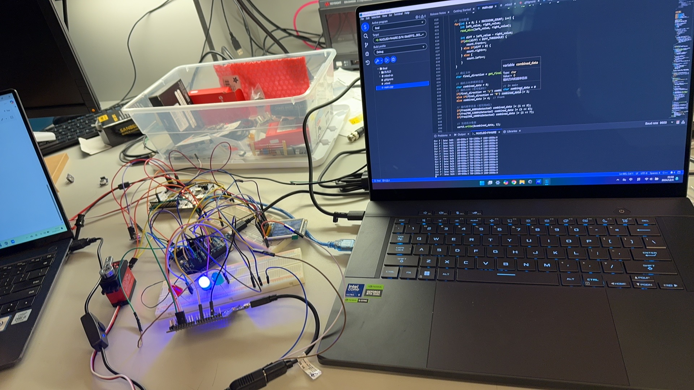
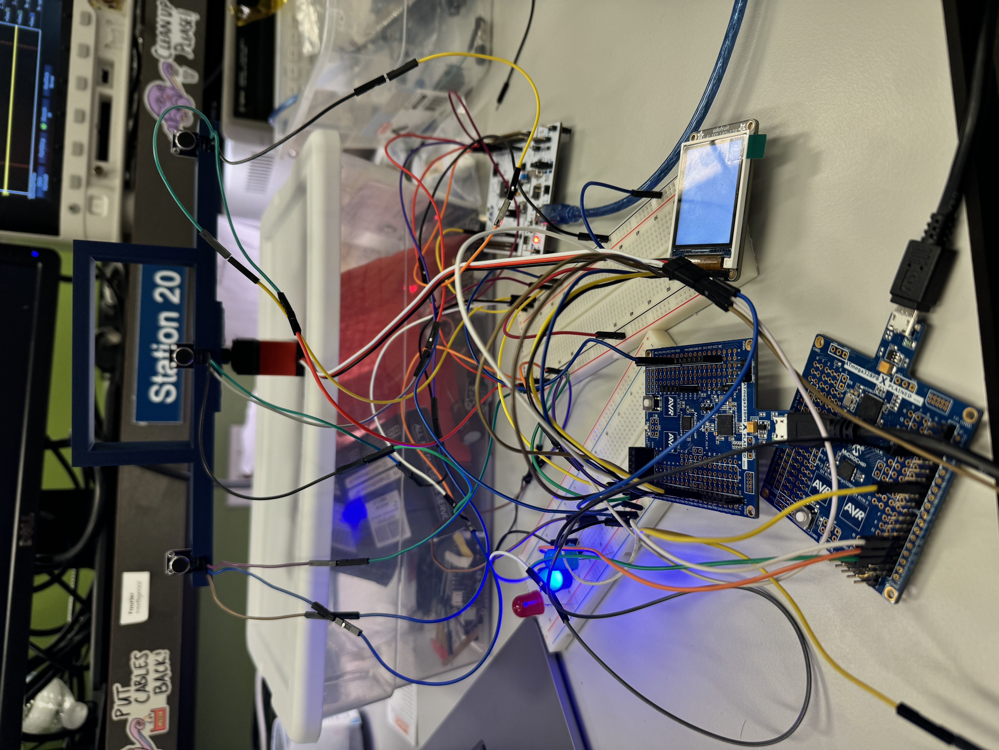

# final-submission

    * Team Number: 21
    * Team Name: V50
    * Team Members: Gengzhi Zhu & Yuetian Zhao & Jinrong Liu
    * Github Repository URL: https://github.com/upenn-embedded/final-project-v50
    * Github Pages URL: https://yuetianzhao.github.io/team21.github.io/
    * Description of test hardware: 
         STM32 Microcontroller
         ATMEGA328PB Microcontroller
         MAX4466 Microphone Sensor
         1.8" Color TFT LCD with SPI Interface
         3 LEDs
         RC Servo motor

## 1. Video Presentation

  

## 2. Project Summary and images

<table><tr>
   <td></td>
   <td></td>
   <td></td>
</tr><tr>
</tr></table>

### Device Description
Our device aims to create a sound detect system, allowing users to speak and the RC SERVO motor will rotate to follow the source of the sound. Users can use LCD to check the different component of the frequency. Moreover, LEDs can also be a way to show the source of the sound(left, front, right).

### Inspiration
The inspiration for our sound detection system comes from the challenges faced by cameramen in dynamic environments, where quickly identifying and tracking the source of a sound is crucial. Imagine a live event or a documentary shoot—cameramen often need to react swiftly to unexpected sound cues, such as a speaker's voice, a sudden noise, or other auditory signals. By enabling the camera to automatically identify and follow the source of the sound, our system aims to revolutionize filming dynamics, enhancing efficiency and ensuring that key moments are captured seamlessly. This innovation bridges the gap between auditory and visual tracking, empowering creators to focus on storytelling rather than manual adjustments.

### Device Functionality
Our sound detection and tracking system is designed to seamlessly integrate auditory and visual intelligence, offering the following key functionalities:
1. Sound Source Tracking: The system identifies the direction of the sound source in real time, distinguishing whether it is coming from the left, right, or directly in front of the device.
2. Directional Sound Information Display: It visually displays the detected sound's directional information, categorizing it into left, right, or front regions for intuitive understanding.
3. Frequency Component Analysis: The system analyzes the frequency components of the detected sound, providing detailed insights into the audio characteristics of each directional segment.
4. Motorized Camera Rotation: The system is equipped with motorized rotation capabilities, enabling the camera to automatically orient itself toward the source of the sound, ensuring accurate tracking and capturing of the scene.

## 3. Hardware Requirements

#### HRS 01 - STM32 Microcontroller
Our project is based on evaluation board. The MCU STM32 microcontroller, with ST-link used to flash the code into the Board.

#### HRS 02 - MAX4466 Microphone Sensor
In compliance with HRS 02, our system employs the MAX4466 module microphone sensor, which detects a wide range of sound and amplify it, when no sound, the system should show 2048 value for our 12-bit ADC. The typical accuracy is ±5 % for offset situation and with high volume, the ADC value should reaches 3000, for low volume, ADC should reaches 2500.

#### HRS 03 - 1.8" Color TFT LCD with SPI Interface
The implementation of the 1.8" Color TFT LCD with an SPI interface in our project was crucial for displaying detailed sound information. This LCD module communicates with the microcontroller through the SPI, ensuring swift and stable data updates.

#### HRS 04 - RC Servo motors
The RC servo motors should rotate according to the postion of the sound, and it can rotate from 0 to 270 Degrees, it should follow the sound with accuracy that it should point to the sound that less than 20 degree.

#### HRS 05 - System Integration and Control
Our development team has implemented a system that use three evaluation board(2 ATMEGA328PB and 1 STM32), we use USB as power supply which enable the system work correctly.

## 4. Software Requirements

#### SRS 01 - ADCs and DMA for FFT
The ADCs should set in continuous mode, and let the A/D transition less than 50us per data and then transmit to array by DMA, by doing this, it can have enough 256 bytes data for FFT and also to improve accuracy. 
image4

#### SRS 02 - Display Management
We manage a 1.8" Color TFT LCD screen with an SPI interface, capable of displaying sound details. Current performance shows 3 different range of frequency component of the sound and show the position of the sound, the data to SPI is 9600 BPS.
image5

#### SRS 03 - UART and GPIO data transmition
Our system need to transmit data from STM32 to ATMEGA328PB, we use two communication approach, UART with 9600 baud rate and GPIO that will set high for 60ms when detect the postion sound information(left, front, right).
The following figure shows the test to detect if the stm32 successfully transfers the signal to the atmega via uart3. We have added the function in the code to let the serial monitor display the content of the transfer, and the output of the stm32 TX will be displayed to the serial monitor to verify the communication between the two MCUs.

image6

## 5. Conclusion
Reflecting on the development process of our sound detection and tracking system, several aspects could have been approached differently to enhance efficiency and performance:

1.Microphone Selection and Calibration Process: To address the challenge of inaccurate microphones, we could have prioritized the selection of high-quality directional microphones or microphone arrays from the outset. Additionally, incorporating an automated or algorithm-driven calibration process would have significantly reduced the time and effort required for manual adjustments, improving the system’s adaptability to different environments.

2.Conflict Resolution between UART and Timer1: The conflict between UART and Timer1 could have been mitigated earlier in the design phase by adopting advanced resource-sharing techniques or exploring alternative communication protocols like SPI. This would have minimized integration issues and streamlined the motor rotation control. Leveraging simulation tools to identify and address hardware conflicts during the initial development stages might have saved debugging time later on.  

  
## 6.Challenges
In general, we faced four challenges and partly solved them in the right way.

#### 1. Microphone Calibration for Accuracy
One of the key challenges is the microphone's initial inaccuracy in detecting and localizing sound sources. Precise sound direction detection requires meticulous calibration to ensure the system's reliability. This calibration process can be time-consuming, especially in environments with varying acoustics or interference, requiring careful adjustments to align the microphone array for optimal performance.
#### 2. UART and Timer1 Conflict for Motor Rotation
Another significant challenge is managing the conflict between the UART communication protocol and Timer1, which controls the motor rotation. Both functionalities are critical, but their simultaneous operation can lead to timing issues and resource contention. Resolving this conflict requires efficient scheduling or alternative methods, such as interrupt-driven mechanisms or prioritization strategies, to ensure seamless motor control without disrupting data communication.
####3.Establishing stable communication between three microcontrollers powered by different USB ports. 
In our project, it was equally challenging to establish stable communication between three microcontrollers powered by different USB ports, where the STM32 communicates with the ATmega1 via UART and the ATmega1 communicates with the ATmega2 via GPIO.   

The instability during system startup is the main problem we encountered. Since each MCU is powered by a different USB port, there are slight differences in the ground potentials of the different USB ports, which may form ground loops when we connect a common ground, and these loops will introduce interference in the communication signals, resulting in unpredictable logic levels caused by voltage differences between different USB grounds. Also, asynchronous startup timing of the three boards and differences in power supply stabilisation times can cause UART communication to start before the system is fully stabilised, resulting in data errors  
.
To address these challenges, we created a single common grounding point, added a startup delay sequence to the code, added an error detection mechanism for the communication protocols, and implemented a system reset sequence that ensures that the three MCUs initialise correctly.  

Despite these measures, the system still required a specific power-up sequence to establish stable communication: we needed to power up the STM32 first and wait for it to stabilise, then power up the two ATmega's in turn and ensure that all ground connections were reliable.

Translated with DeepL.com (free version)

##  Project Codebase Links
github:https://github.com/upenn-embedded/final-project-v50
